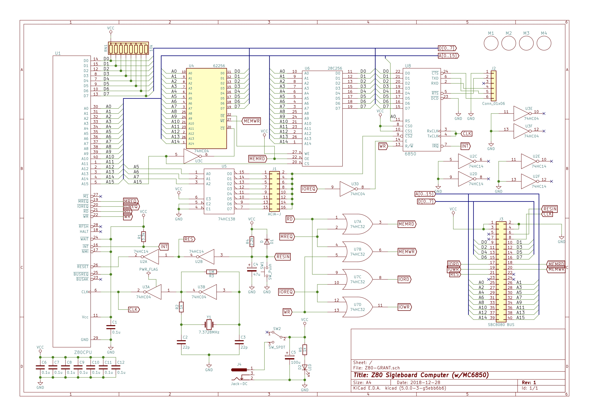

# Z80_SB_MC6850

## 概要
- Z80 CPUを搭載した シングルボードコンピューターです。シリアルチップは MC6850です。
  - 以下のGrrant氏の回路図を参考に、SBC8080バスへ接続できるように改良したものとなります。
  - http://searle.hostei.com/grant/z80/SimpleZ80_32K.html

## 回路図

## 部品表
- 部品表は以下にあります。
  - [https://github.com/kuninet/Z80_SB_MC6850/blob/master/KiCAD/Z80-GRANT.ods](https://github.com/kuninet/Z80_SB_MC6850/blob/master/KiCAD/Z80-GRANT.ods)

## 注意点
- ★本基板は試作して確認中のため不具合を含んでいる可能性があります。
